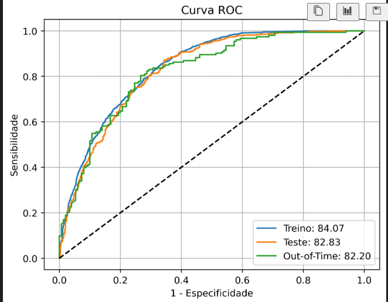
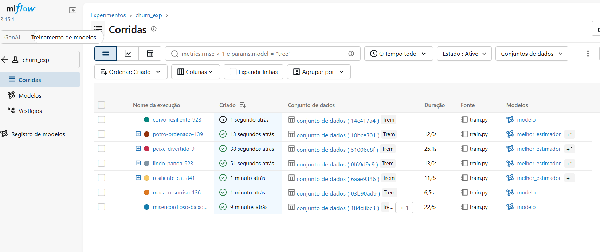

# 🧠 Aprendizado de Máquina Aplicado

Repositório de estudos práticos em **Machine Learning**, desenvolvido durante o curso de Machine Learning do [Téo Me Why](https://www.youtube.com/@TeoMeWhy). Reúne implementações de algoritmos de regressão, classificação e árvores de decisão aplicados a datasets didáticos, e culmina em um **modelo de churn** completo, com validação out-of-time, otimização de hiperparâmetros e rastreamento de experimentos no **MLflow**.

## 🎯 Sobre o projeto

Este repositório documenta a prática hands-on dos principais algoritmos supervisionados de ML em Python, com foco em construir intuição sobre como cada modelo aprende, generaliza e se comporta diante de dificuldades de aprendizagem.

Cada script explora um problema e um conceito específico:

| Script | Problema | Conceitos aplicados |
|---|---|---|
| [`scripts/regressao.py`](./scripts/regressao.py) | Prever a nota de uma cerveja a partir do consumo | Regressão Linear, Árvore de Decisão (Regressor), comparação de overfitting entre modelo full e com `max_depth` limitado |
| [`scripts/classificacao.py`](./scripts/classificacao.py) | Prever aprovação com base no consumo de cerveja | Regressão Logística, Árvore de Decisão, Naive Bayes, comparação de fronteiras de decisão e probabilidades |
| [`scripts/cerveja.py`](./scripts/cerveja.py) | Classificar o estilo de uma cerveja (`classe`) a partir de temperatura, copo, espuma e cor | Árvore de Decisão (Classifier), encoding manual de variáveis categóricas, visualização da árvore |
| [`scripts/frutas.py`](./scripts/frutas.py) | Classificar frutas por características físicas | Árvore de Decisão (Classifier), predição de classes e probabilidades, visualização da árvore |
| [`scripts/star_wars.py`](./scripts/star_wars.py) | Classificar clones como aptos/defeituosos | Árvore de Decisão com dataset mais complexo (múltiplas features categóricas e numéricas), encoding manual de variáveis ordinais |
| [`scripts/metricas.py`](./scripts/metricas.py) | Prever se uma pessoa se considera feliz, a partir de uma pesquisa da comunidade | Engenharia de features (`get_dummies`), comparação de Árvore/Naive Bayes/Regressão Logística, métricas de avaliação (acurácia, precisão, recall, curva ROC, AUC), exportação do modelo com `pickle` |
| [`train.py`](./train.py) | Prever **churn** de clientes | Pipeline completo: amostra out-of-time (OOT), seleção de features, discretização, Random Forest com `GridSearchCV`, avaliação em treino/teste/OOT e rastreamento com MLflow |

## 📉 Destaque: modelo de churn

O exercício de churn reúne, em um único fluxo, os conceitos trabalhados ao longo do repositório, seguindo as etapas **Sample, Explore, Modify, Model e Assess (SEMMA)**.

### Pipeline

1. **Sample:** a safra mais recente (`dtRef` máxima) é separada como base **out-of-time (OOT)**. O restante é dividido em treino e teste (80/20), estratificado pela variável resposta (`flagChurn`).
2. **Explore:** análise de valores faltantes e comparação de média e mediana de cada variável entre clientes que cancelaram e os que permaneceram.
3. **Seleção de features:** uma Árvore de Decisão calcula a importância das variáveis, e são mantidas aquelas que somam até 96% da importância acumulada.
4. **Modify:** discretização das variáveis com `DecisionTreeDiscretiser` e `OneHotEncoder` (biblioteca `feature-engine`).
5. **Model:** `RandomForestClassifier` com `GridSearchCV` (`min_samples_leaf`, `n_estimators` e `criterion`), otimizado por ROC AUC com validação cruzada de 3 folds.
6. **Assess:** acurácia e AUC em treino, teste e OOT, além da curva ROC comparativa.

As etapas de transformação e o modelo são encadeados em um `Pipeline` do scikit-learn, de modo que discretização e encoding são ajustados somente com os dados de treino, evitando vazamento de informação.

### Resultados

| Base | AUC |
|---|---|
| Treino | 84,07 |
| Teste | 82,83 |
| Out-of-Time | 82,20 |



A diferença de cerca de 1,9 ponto de AUC entre treino e OOT indica **baixo overfitting** e boa estabilidade do modelo ao longo do tempo. A curva do OOT é mais irregular por se tratar de uma base menor.

### Rastreamento de experimentos com MLflow

Cada execução registra parâmetros, métricas (`acc_*` e `auc_*` para treino, teste e OOT) e o modelo treinado no experimento `churn_exp`, o que permite comparar iterações do modelo.



Para visualizar os experimentos localmente:

```bash
mlflow server --host 127.0.0.1 --port 5000
```

## 🛠️ Tecnologias

- **Python 3**
- **pandas**: manipulação e preparação de dados
- **scikit-learn**: modelos, pipelines, busca de hiperparâmetros e métricas (`linear_model`, `tree`, `naive_bayes`, `ensemble`, `pipeline`, `model_selection`, `metrics`)
- **feature-engine**: discretização e encoding de variáveis
- **MLflow**: rastreamento de experimentos e registro de modelos
- **matplotlib**: visualização de dados, árvores de decisão e curvas ROC
- **openpyxl** / **pyarrow**: leitura de arquivos `.xlsx` e `.parquet`

## 📁 Estrutura

```
aprendizado_de_maquina_aplicado/
├── data/                       # datasets utilizados nos exercícios
│   ├── abt_churn.csv
│   ├── dados_cerveja.xlsx
│   ├── dados_cerveja_nota.xlsx
│   ├── dados_clones.parquet
│   ├── dados_comunidade.csv
│   ├── dados_frutas.xlsx
│   └── predict.csv
├── images/                     # imagens utilizadas neste README
│   ├── curva_roc_churn.png
│   └── mlflow_runs_churn.png
├── scripts/
│   ├── regressao.py
│   ├── classificacao.py
│   ├── cerveja.py
│   ├── frutas.py
│   ├── star_wars.py
│   ├── metricas.py
│   ├── model_feliz.pkl         # modelo exportado por metricas.py
│   └── predict.csv             # predições geradas por metricas.py
├── train/
│   └── train.py                # exploração inicial da ABT de churn
├── train.py                    # pipeline completo do modelo de churn (com MLflow)
└── README.md
```

## 🚀 Como executar

1. Clone o repositório:
   ```bash
   git clone https://github.com/FernandaMoura96/aprendizado_de_maquina_aplicado.git
   cd aprendizado_de_maquina_aplicado
   ```

2. Instale as dependências:
   ```bash
   pip install pandas scikit-learn matplotlib openpyxl pyarrow feature-engine mlflow
   ```

3. Os scripts usam a sintaxe de células `# %%` (compatível com Jupyter/VS Code Interactive Window). Ajuste os caminhos dos arquivos em `data/` para o seu ambiente local (os caminhos originais apontam para uma pasta local, ex. `C:/Users/nanda/...`) e execute célula por célula, ou rode o arquivo completo:
   ```bash
   python scripts/regressao.py
   ```

4. Para executar o modelo de churn, inicie antes o servidor do MLflow (em outro terminal) e depois rode o script:
   ```bash
   mlflow server --host 127.0.0.1 --port 5000
   python train.py
   ```

## 🔭 Próximos passos

- Avaliar métricas complementares ao AUC para o churn (precisão, recall, PR-AUC, KS e lift por decil), já que a acurácia com limiar de 0,5 pode ser enganosa em bases desbalanceadas
- Comparar o modelo atual com um baseline sem discretização e com Gradient Boosting (LightGBM/XGBoost)
- Registrar no MLflow a curva ROC e a lista de features selecionadas como artefatos
- Interpretar o modelo final (importância das variáveis e perfil dos clientes de maior risco) e definir uma faixa de corte ligada a uma ação de negócio
- Substituir caminhos absolutos por caminhos relativos

## 📌 Principais aprendizados

- Diferença prática entre regressão e classificação, e quando cada abordagem se aplica
- Como o `max_depth` de uma Árvore de Decisão impacta overfitting vs. generalização
- Comparação de modelos lineares (Regressão Linear/Logística) com modelos não paramétricos (Árvores, Naive Bayes) sobre o mesmo problema
- Preparação de dados categóricos (encoding) como etapa essencial antes da modelagem
- Avaliação de modelos de classificação com métricas além da acurácia (precisão, recall, ROC/AUC)
- Boas práticas de separação de dados em problemas com componente temporal (amostra out-of-time)
- Construção de pipelines reprodutíveis, com otimização de hiperparâmetros e rastreamento de experimentos no MLflow

## 👩‍💻 Autora

**Fernanda Moura**
Em transição de carreira para Análise/Ciência de Dados, com background em operações comerciais.
[GitHub](https://github.com/FernandaMoura96)

---
*Projeto desenvolvido para fins de estudo, como parte do curso de Machine Learning do Téo Me Why.*
